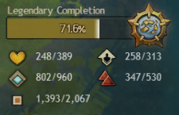

# GW2-TrueWorldCompletion

Public part of the Guild Wars 2 addon **True World Completion**.
This repository contains the build and dependency setup, basic instructions, option explanations, and code unrelated to reverse engineering.

The addon loads using [Nexus](https://github.com/RaidcoreGG/Nexus) and modifies the game's display of map/world completion beyond the default — maps that grant a reward upon reaching 100% and progress toward the **Gift of Exploration**.

These enhancements include numerous points of interest, vistas, and other discoverable content per character on maps such as:
- Story-exclusive instances
- Dungeons and raids
- Guild Halls
- Festival and historical instances
- Competitive modes

The addon dynamically detects discoverable content and allows the user to include or exclude anything from the displayed completion freely.

Furthermore, world completion progress can be separated:
- Between “continents” (Tyria / The Mists)
- Between each expansion cycle

Finally, addon provides hinting system guiding toward incomplete maps, while loading screens and content discovery alerts on maps without a 100% reward can (optionally) display progress toward completion.

Notably, the addon **does not modify** the actual amount of content required to earn any reward — whether per map or globally. It is purely a **graphical interface adjustment**.

---

### Preview


---

## Building / Requirements

To build this project, you’ll need:
- Access to the private, reverse-engineering component
- A C++ toolchain capable of building for Windows targets (e.g. clang or MSVC)
- **CMake** for project configuration
- **Conan** for dependency management

The entire build infrastructure is available as a [Docker container](https://github.com/users/jsantorek/packages/container/package/gw2-addon-builder), with additional environment setup hints (including clang profiles for Linux-based cross-compilation) available in its [Dockerfile](https://github.com/jsantorek/GW2-AddonBuilder/blob/main/dockerfile).

---

### Local Build

1. When current working dir is <repo-path>, install dependencies via Conan:
   ```bash
   conan install . --build=missing --profile:build=default --profile:host=windows --settings:host=build_type=Release
   ```
2. (Optional) Activate the virtual environment, depending on your profile and setup:
   ```bash
   source build/Release/generators/conanbuild.sh
   ```
3. Generate build files via CMake:
   ```bash
   cmake --preset=conan-release
   ```
4. Build the project:
   ```bash
   cmake --build --preset=conan-release
   ```

Once built, place the compiled `True_World_Completion.dll` library in the game’s `addons` subdirectory. Then, launch the game with **Nexus** and load "True World COmpletion" through its menu.

---

### Docker Build

```bash
docker run --rm     -v <repo-path>:/addon     ghcr.io/jsantorek/gw2-addon-builder:latest     bash -c "\
        conan install . --build missing --profile windows-dynamic &&\
        cmake --preset conan-release &&\
        cmake --build --preset conan-release &&\
        cmake --install build/Release --prefix install "
```

---

### Support
[](https://discord.com/channels/410828272679518241/1336830031053324308)
